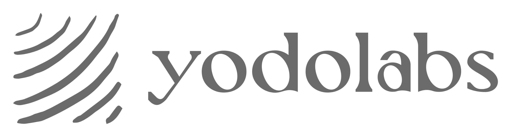
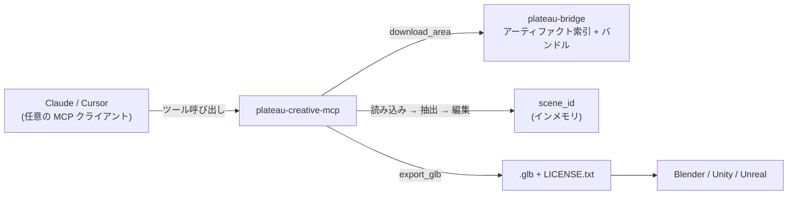
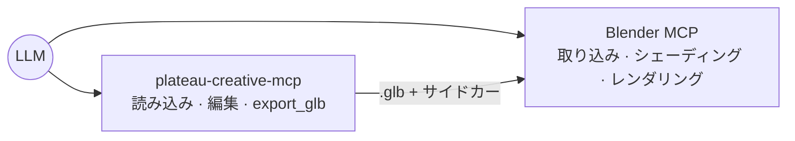

<div align="center">

<picture>
  <source media="(prefers-color-scheme: dark)" srcset="docs/assets/yodolabs-logo-dark.png">
  
</picture>

# @yodolabs/plateau-creative-mcp

**Project PLATEAU の 3D 都市データを、シーン編集と glTF エクスポートのツール群に変える MCP サーバー。クリエイティブな LLM エージェントのために。**

[](LICENSE)
[](https://www.mlit.go.jp/plateau/)
[](package.json)

[English](README.md) · **日本語**

</div>

> このサーバーが提供するのは「ツール」です。それらをどう組み合わせて使うか（オーケストレーション）は LLM の仕事です。Claude / Cursor などお好みの MCP クライアントから、Blender MCP / Unity MCP / Unreal MCP と並べてこのサーバーを指定し、ワークフローを組み立てさせてください。

PLATEAU には、データアクセス（カタログ・仕様・CityGML・属性）のための公式 MCP サーバーがあります。本サーバーは、そこに足りていない **「生成・シーン編集・DCC エクスポート」** のレイヤーを担います。東京のある街区を読み込み、高層ビルをすべて削除し、ある区画を 3 倍の高さに引き伸ばし、Blender / Unity / Unreal にそのまま取り込める `.glb` を書き出す——その一連を、すべてツール呼び出しで実現します。



## ステータス

**v0.1.0 — 初の一般公開リリース。** 10 個の MCP ツール（オンデマンドのアーティファクトダウンロードを含む。データの clone は不要）、メッシュ結合を伴うポリゴンのフットプリント押し出し、1 km² 以下の単一 GLB エクスポート（gltf-transform で約 40% 圧縮）、大きな範囲向けの `scene_manifest`（3D Tiles）フォールバック、3 つのデータアクセス方式（TS+duckdb アーティファクト / Python サブプロセス / 上流 MCP への JSON-RPC）、Overpass による POI 紐付け、そして任意で利用できる BlenderMCP への MCP 間ブリッジを備えます。MCP 経由でベンダーニュートラル——Claude でも Cursor でも、どのクライアントでも動作します。

## ツール

| ツール | 用途 |
|---|---|
| `download_area` | `plateau-bridge` のアーティファクト索引から、構築済みの都市バンドルを取得してキャッシュします（スラッグを解決し、`.tar.zst` をダウンロード、sha256 を検証し、`buildings.parquet` + `manifest.json` を展開）。これによりデータパイプラインを clone せずに `load_area` が使えます。 |
| `load_area` | 都市 + bbox + LOD を新しい `scene_id` に読み込みます。 |
| `filter_buildings` | シーン内の建物を高さ / 年次 / 用途 / 用途地域 / 浸水深で絞り込み、`building_uid[]` を返します。 |
| `delete_buildings` | 反実仮想的な編集——建物を「削除済み」としてマークします。 |
| `extrude_buildings` | 建物の高さを指定倍率でスケールします。 |
| `compose_scene` | レンダリング用のヒント（時刻・天候・カメラ）を設定します。 |
| `export_glb` | `.glb`（`single_glb`、parquet から起こした実ジオメトリ）または 3D Tiles を参照する `scene_manifest` を書き出します。`scene_manifest` のタイル付与にはローカルビルドした 3D Tiles が必要で、ダウンロード済みの都市ではタイルなしのマニフェスト（編集内容 + bbox + 帰属表示）に `tileset_note` が付きます。 |
| `link_buildings_to_pois` | 近傍の OSM POI（Overpass）と建物を関連付けます。 |
| `get_attribution` | シーンのデータセット / ライセンス / URL のメタデータ一式を返します。 |
| `render_via_blender` | シーンを GLB として書き出し、任意で BlenderMCP 互換の HTTP MCP サーバーへ JSON-RPC でブリッジします。ドライランでは、推奨される MCP 間呼び出し手順を返します。 |

`PLATEAU_UPSTREAM_ENABLED=true` のとき、本サーバーは [公式 Project PLATEAU MCP サーバー](https://github.com/Project-PLATEAU/plateau-streaming-tutorial/blob/main/mcp/plateau-mcp.md) からプロキシした 13 個のツール（`plateau_spec_outline`, `plateau_spec_read`, `plateau_get_metadata`, `plateau_search_areas`, `plateau_get_area`, `plateau_search_datasets`, `plateau_get_dataset`, `plateau_list_dataset_types`, `plateau_citygml_get_attributes`, `plateau_citygml_get_features`, `plateau_citygml_get_geoid_height`, `plateau_get_citygml_files`, `plateau_explain_spatial_id`）も **あわせて** 公開します。LLM クライアントからは 1 つのカタログに 23 ツールが見え、2 つの MCP サーバーを別々に繋ぐ必要はありません。

各ツールは `{ result, attribution_metadata }` を返します。`export_glb` は `asset.extras.attribution` を GLB に書き込み、隣に `LICENSE.txt` を出力します。派生物（動画・画像・アセット）では、この帰属表示を必ず保持してください。

## クイックスタート

```bash
npm install
npm run build
```

都市データを用意する方法は 2 通りあります。

### 方法 A — セットアップ不要（推奨）

データパイプラインを clone する必要はありません。本サーバーは標準で公開された [`plateau-bridge`](https://github.com/pixelx-jp/plateau-bridge) のアーティファクト索引を参照するため、`download_area` は設定なしで動作します。都市の構築済みバンドルを取得し、sha256 を検証して、ローカルにキャッシュします。

```bash
export PLATEAU_AUTO_DOWNLOAD=true     # load_area が未取得の都市を自動ダウンロード（任意）
export PLATEAU_OUTPUT_DIR=./out
npx @yodolabs/plateau-creative-mcp             # stdio の MCP サーバー
```

最初に一度 `download_area(city="shibuya")` を呼ぶか、`PLATEAU_AUTO_DOWNLOAD=true` を設定して `load_area` を呼ぶだけ（未取得なら先にダウンロードします）でかまいません。展開されるのは `buildings.parquet` + `manifest.json` のみです。バンドルは `PLATEAU_ARTIFACT_DIR`（既定値 `~/.cache/plateau-creative-mcp/artifacts`）にキャッシュされるため、各都市のダウンロードは一度だけです。独自のミラーを使うときは `PLATEAU_ARTIFACT_INDEX_URL` を差し替えてください。

ダウンロードされるバンドルに 3D Tiles は **含まれません**（都市あたり数 GB になるため）。parquet があれば、`load_area`・各種編集・`export_glb` の **single_glb**（実ジオメトリ、1 km² / 5000 棟以内）はすべて動作します。ダウンロード済みの都市で機能が限られるのは `scene_manifest` のタイル参照だけで、その場合も編集内容・bbox・帰属表示は出力され、`tileset_note` で「single_glb に範囲を絞る」か「ローカルビルドする」よう案内します。より広い範囲を実ジオメトリで書き出したいときは、方法 B（ローカルビルド）を使ってください。

Claude Desktop では `claude_desktop_config.json` に次を追加します。

```jsonc
{
  "mcpServers": {
    "plateau-creative": {
      "command": "npx",
      "args": ["-y", "@yodolabs/plateau-creative-mcp"],
      "env": {
        "PLATEAU_AUTO_DOWNLOAD": "true",
        "PLATEAU_OUTPUT_DIR": "/Users/you/plateau-out"
      }
    }
  }
}
```

### 方法 B — 手元のアーティファクトを使う

すでに [`plateau-bridge`](https://github.com/pixelx-jp/plateau-bridge) の `out_<city>/` 出力がある場合は、そこを直接指定します。

```bash
export PLATEAU_ARTIFACT_DIR=/path/to/plateau-bridge
export PLATEAU_OUTPUT_DIR=./out
npx @yodolabs/plateau-creative-mcp        # stdio の MCP サーバー
```

```jsonc
{
  "mcpServers": {
    "plateau-creative": {
      "command": "npx",
      "args": ["-y", "@yodolabs/plateau-creative-mcp"],
      "env": {
        "PLATEAU_ARTIFACT_DIR": "/path/to/plateau-bridge",
        "PLATEAU_OUTPUT_DIR": "/Users/you/plateau-out"
      }
    }
  }
}
```

MCP クライアントなしでの動作確認:

```bash
npx tsx scripts/smoke-load-area.ts
```

## ワークフロー例

### 1. サイバーパンクな渋谷のフライスルー（MCP 間連携）

```
load_area(city="shibuya", bbox=[139.6975,35.6555,139.7045,35.6605], lod=2)
  -> compose_scene(time="19:30", weather="rain")
  -> export_glb()              # ./out/<scene>_v3.glb へ
=> BlenderMCP: import_glb + サイバーパンク調シェーダー + レンダリング
```



### 2. 高層ビルのない東京

```
load_area(...)
  -> filter_buildings({height_min: 100})
  -> delete_buildings(filter={height_min: 100})
  -> export_glb()
```

### 3. オフィスタワーのドラフト（アーティファクトに用途地域フィールドが必要）

```
load_area(...)
  -> filter_buildings({zoning_use: ["commercial"], far_max_min: 400})
=> SketchUp MCP: その区画内に新しい建物を設計
```

> **デモ動画:** リリース時に 60 秒のウォークスルーをここに掲載します。

## アーキテクチャ

```
src/
  server/   MCP プロトコルの入口、ツールレジストリ、統一エンベロープ
  tools/    10 個の MCP ツールハンドラ
  schemas/  Zod スキーマ + JSON Schema 出力
  scene/    scene_id の LRU + ロック + 任意のディスク永続化
  data/     アーティファクト（duckdb）アクセス層 + オンデマンドのバンドルダウンローダ
  export/   three.js のシーン構築 + GLTFExporter + マニフェストのフォールバック
  attribution/  エンベロープのラップ、帰属表示のマージ
  rateLimit/    (client, tool) ごとのトークンバケット
  errors/   安定したエラーコード + AppError
  config/   環境変数ベースの設定
  utils/    id・bbox・パス・ロガー
```

- **`scene_id`** が唯一の共有状態です。変更系・エクスポート系のツールはすべてこれを参照します。ID はサーバーが生成する ULID です。
- **`building_uid`** が建物を指す唯一の正規参照です。`gml_id` やバッチインデックスなどの代替は持ちません。
- **`export_glb` の上限**: `single_glb` は bbox が 1 km² 以下 **かつ** 5000 棟以下。これを超えるシーンは `EXPORT_LIMIT_EXCEEDED` を返し、`scene_manifest` への切り替えを提案します。
- **帰属表示** はエグゼキュータの層でラップされます——帰属表示なしに結果を返せるハンドラは存在しません。

## 設定

| 環境変数 | 既定値 | 説明 |
|---|---|---|
| `PLATEAU_ARTIFACT_DIR` | `~/.cache/plateau-creative-mcp/artifacts` | `out_<city>/buildings.parquet` を含むディレクトリ。既定ではキャッシュディレクトリ（`download_area` の書き込み先）。既存の `plateau-bridge` チェックアウトを指すよう設定することもできます。 |
| `PLATEAU_ARTIFACT_INDEX_URL` | plateau-bridge の `distribution/index.json` | 各都市のバンドル URL + sha256 を載せたキャッシュ索引（JSON）。既定は公開ミラー。独自ミラーを使う場合に差し替えます。 |
| `PLATEAU_ARTIFACT_DOWNLOAD_TIMEOUT_MS` | `300000` | ダウンロード 1 件あたりのタイムアウト（ミリ秒、5 秒〜30 分）。 |
| `PLATEAU_AUTO_DOWNLOAD` | `false` | `true` にすると、`load_area` が読み込み前に未取得の都市を索引から自動取得します。 |
| `PLATEAU_OUTPUT_DIR` | `./out` | `.glb` / `LICENSE.txt` / マニフェストの出力先。 |
| `PLATEAU_DATA_MODE` | `artifact` | `artifact`（TS + duckdb）または `subprocess`（Python ヘルパー）。 |
| `PLATEAU_PYTHON_BIN` | `python3` | `subprocess` モードで使う Python インタプリタ（`duckdb` が必要）。 |
| `PLATEAU_SUBPROCESS_SCRIPT` | 同梱の `python/plateau_query.py` | JSON-stdio ヘルパーのパスを上書き。 |
| `PLATEAU_SCENE_DIR` | `./.scene-store` | シーン永続化を有効にしたときのディスク保存先。 |
| `PLATEAU_PERSIST_SCENES` | `false` | `true` で呼び出し間にシーンをディスクへ直列化。 |
| `PLATEAU_MAX_SCENES` | `64` | インメモリシーンの LRU 上限。 |
| `PLATEAU_SCENE_TTL_MS` | `3600000` | シーンの TTL（ミリ秒）。 |
| `OSM_OVERPASS_URL` | 未設定 | `link_buildings_to_pois` を有効化（例: `https://overpass-api.de/api/interpreter`）。 |
| `OSM_OVERPASS_TIMEOUT_MS` | `25000` | Overpass リクエストのタイムアウト。 |
| `PLATEAU_UPSTREAM_ENABLED` | `false` | `true` でホスト版 PLATEAU MCP にプロキシする 13 個の公式 `plateau_*` ツールを登録。 |
| `OFFICIAL_PLATEAU_MCP_URL` | ホスト版の既定値 | 公式 PLATEAU MCP のエンドポイントを上書き（まれ）。 |

コピーして使えるテンプレートは [`.env.example`](.env.example) を参照してください。

### フットプリントジオメトリとボックスフォールバック

DuckDB の `spatial` 拡張によるポリゴン押し出しが既定で有効です（初回実行時に拡張を自動インストール）。インストールやロードに失敗した場合（オフライン CI、制限された環境など）、エクスポータは建物ごとの重心を基準にした 12 m × 12 m のボックスへ綺麗にフォールバックします。高精度パスが有効なときは、`load_area` のレスポンスの `available_attributes` に `footprint_polygon` が含まれます。

### メッシュ結合とサイドカー索引

`single_glb` エクスポートは、すべての建物を 1 つの `BufferGeometry` に結合します——ドローコール 1 回、GLB の JSON オーバーヘッドも大幅に削減されます。下流の編集ツール向けに建物ごとの同一性を保つため、各エクスポートは GLB の隣にサイドカー `<basename>.buildings.json` を書き出します。

```json
{
  "scene_id": "scene_01...",
  "version": 4,
  "merged": true,
  "total_triangles": 73482,
  "ranges": {
    "<building_uid>": [{"triangle_start": 0, "triangle_count": 18}]
  }
}
```

### scene_manifest モード

エクスポートが単一 GLB の上限（1 km² / 5000 棟）を超える場合は `mode: "scene_manifest"` を指定できます。マニフェストは対応する 3D Tiles の `tileset.json` をリンクし、シーンの bbox と交差するリーフタイルのコンテンツ URI を列挙します——下流の利用側は必要なタイルだけを遅延ロードできます。

```json
{
  "scene_id": "scene_01...",
  "mode": "scene_manifest",
  "bbox": [139.69, 35.65, 139.72, 35.67],
  "tileset": "/abs/path/out_shibuya/3dtiles/tileset.json",
  "tileset_available": true,
  "tiles": [
    {
      "url": "/abs/path/out_shibuya/3dtiles/15/29096/4943_bldg_Building.glb",
      "relative_uri": "15/29096/4943_bldg_Building.glb",
      "bbox": [139.6984, 35.6577, 139.7060, 35.6644],
      "min_height_m": 39.3,
      "max_height_m": 332.3
    }
  ],
  "edits": { "deleted_building_uids": [], "extrusions": [] },
  "attribution": { "license": "CC BY 4.0" }
}
```

3D Tiles はローカルビルドで生成されるもので、オンデマンドのダウンロードバンドルには含まれません。ダウンロード済みの都市では、`scene_manifest` はタイルなしのマニフェスト（編集内容 + bbox + 帰属表示）を `tileset_note` 付きで返します。

### POI 紐付け

`link_buildings_to_pois` には `OSM_OVERPASS_URL` が必要です。設定すると、シーンの bbox 内の `amenity` / `shop` / `office` / `tourism` / `leisure` ノードを Overpass QL で問い合わせ、名前付き POI を `max_distance_m` 以内で最も近い建物の重心に紐付けます。ODbL の帰属表示は返却エンベロープに自動でマージされます。

## 対象外（意図的に）

- `export_3dgs` — ガウシアンスプラッティングの往復は今後の課題です。
- `export_usd` — Isaac Sim 向けの別プロジェクトです。
- `simulate_earthquake` / `simulate_flood` — 別途のリスク分析の取り組みです。
- 汎用的な OSM クエリ — OSM-MCP の領分です。
- MCP 間の自動オーケストレーション — それは LLM の役割です。

## 帰属表示とライセンス

- **ソフトウェア:** MIT（本リポジトリ）。
- **データ:** PLATEAU は **CC BY 4.0**（© Project PLATEAU / 国土交通省）。OSM POI は **ODbL 1.0**。
- すべてのツールのレスポンスは `attribution_metadata` を含みます。`export_glb` はそれを `asset.extras.attribution` に注入し、GLB の隣に `LICENSE.txt` を書き出します。**この `LICENSE.txt` を GLB と一緒に保持し、派生する動画 / スクリーンショットでは PLATEAU をクレジットしてください。**

### GLB 圧縮

`export_glb` で `options.compress: true` を指定すると、gltf-transform のパイプライン（dedup → weld → prune → quantize）を適用します。0.4 km² の渋谷パッチ（507 棟、13.8 万トライアングル）の実測値: **9.94 MB → 6.05 MB（約 40% 削減）**、知覚できる劣化はありません。出力は標準の `KHR_mesh_quantization` 拡張を使うため、Blender・Unity・Unreal・three.js のいずれもネイティブにデコードできます。

### 上流 MCP サーバーとの連携

`JsonRpcMcpClient` は最小限の MCP-over-HTTP クライアント（`tools/list` + `tools/call`）で、上流連携の部品として公開しています。

`OfficialPlateauMcpClient` は [公式 PLATEAU MCP サーバー](https://github.com/Project-PLATEAU/plateau-streaming-tutorial/blob/main/mcp/plateau-mcp.md)（`https://api.plateauview.mlit.go.jp/mcp` でホスト）への型付きラッパーで、上流の 13 ツールすべてをカバーします。

- **仕様**: `specOutline`, `specRead`
- **カタログ**: `getMetadata`, `searchAreas`, `getArea`, `searchDatasets`, `getDataset`, `listDatasetTypes`
- **CityGML**: `citygmlGetAttributes`, `citygmlGetFeatures`, `citygmlGetGeoidHeight`, `getCityGmlFiles`
- **ヘルパー**: `explainSpatialId`

```ts
import { OfficialPlateauMcpClient } from "@yodolabs/plateau-creative-mcp";

const upstream = new OfficialPlateauMcpClient();
const meta = await upstream.getMetadata();
const datasets = await upstream.searchDatasets({ area_codes: ["13113"], year: 2023 });
```

上流の仕様は発展途上のため、レスポンスの型は `[k: string]: unknown` のインデックスシグネチャを使っています。厳密な型が必要な場合は呼び出し側で検証してください。

## 使用例

再現可能なワークフローのレシピは [`examples/`](examples/) にあります——Claude Desktop 用プロンプト（[`examples/claude-prompts.md`](examples/claude-prompts.md)）、Cursor の `.cursorrules`（[`examples/cursor-rules.md`](examples/cursor-rules.md)）、結合 GLB + サイドカーの受け渡しを示す Blender Python スニペット（[`examples/blender-mcp-handoff.py`](examples/blender-mcp-handoff.py)）、そしてサイバーパンク渋谷の通し手順（[`examples/cyberpunk-shibuya.md`](examples/cyberpunk-shibuya.md)）。

## コントリビュート

Issue・PR を歓迎します——[CONTRIBUTING.md](CONTRIBUTING.md) を参照してください。PR を出す前に `npm run lint && npm run typecheck && npm test` を実行してください。

## ロードマップ

**v0.1.0 で提供:** 自前の 10 ツール + 公式 PLATEAU MCP からプロキシした 13 ツール（`PLATEAU_UPSTREAM_ENABLED=true` で合計 23 ツールのカタログ）、オンデマンドのアーティファクトダウンロード（`download_area` + 任意の `load_area` 自動取得）でデータの clone は不要、ボックスフォールバック付きのポリゴンフットプリント押し出し（DuckDB `spatial`）、メッシュ結合 + サイドカー同一性索引、GLB 圧縮（約 40% 削減）、3D Tiles のタイル付与を行う `scene_manifest` モード、Overpass による POI 紐付け、3 つのデータアクセス方式（TS+duckdb アーティファクト / Python サブプロセス / 上流 MCP-over-HTTP）、許可リスト方式の BlenderMCP 互換サーバーへの MCP 間ブリッジ。

**v0.2 で予定:** BlenderMCP / Unity MCP / Unreal MCP との MCP 間連携を収録したデモ。

---

<div align="center">

開発: **[Yodo Labs](https://yodolabs.jp)** — PixelX Inc. / ピクセルエックス株式会社

[`plateau-bridge`](https://github.com/pixelx-jp/plateau-bridge) の上に構築 · データ © [Project PLATEAU](https://www.mlit.go.jp/plateau/) / 国土交通省（CC BY 4.0）

お問い合わせ: [pan@yodolabs.jp](mailto:pan@yodolabs.jp)

</div>
