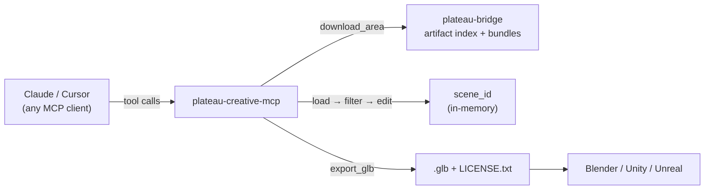
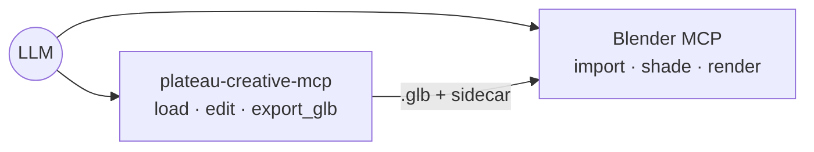

<div align="center">

<picture>
  <source media="(prefers-color-scheme: dark)" srcset="docs/assets/yodolabs-logo-dark.png">
  
</picture>

# @yodolabs/plateau-creative-mcp

**An MCP server that turns Project PLATEAU's 3D city data into scene-editing and glTF export tools for creative LLM agents.**

[](https://www.npmjs.com/package/@yodolabs/plateau-creative-mcp)
[](LICENSE)
[](https://www.mlit.go.jp/plateau/)
[](package.json)

**English** · [日本語](README.ja.md)

</div>

> This server exposes tools. Orchestration is your LLM's job — point Claude / Cursor / any MCP client at this server alongside Blender MCP / Unity MCP / Unreal MCP and let it compose the workflow.

PLATEAU has an official MCP server for **data access** (catalog, specs, CityGML, attributes). This one fills the missing **creation, scene-editing, and DCC export** layer: load a Tokyo neighbourhood, delete every skyscraper, scale a block to 3× height, and emit a `.glb` ready for Blender / Unity / Unreal — all driven by tool calls.



## Status

**v0.1.0 — first public release.** 10 MCP tools (incl. on-demand artifact download — no data clone needed), polygon footprint extrusion with mesh merging, single-GLB export ≤ 1 km² (≈40% gltf-transform compression) with a `scene_manifest` 3D Tiles fallback for larger areas, three data-access modes (TS+duckdb artifact / Python subprocess / upstream MCP via JSON-RPC), Overpass POI linking, and an optional cross-MCP bridge to BlenderMCP. Vendor-neutral over MCP — Claude, Cursor, any client works.

## Tools

| Tool | Purpose |
|---|---|
| `download_area` | Fetch + cache a prebuilt city bundle from the `plateau-bridge` artifact index (resolves the slug, downloads the `.tar.zst`, verifies sha256, extracts `buildings.parquet` + `manifest.json`), so `load_area` works without cloning the data pipeline. |
| `load_area` | Load a city + bbox + LOD into a new `scene_id`. |
| `filter_buildings` | Query `building_uid[]` inside a scene by height / year / use / zoning / flood depth. |
| `delete_buildings` | Counterfactual edits — mark buildings as removed. |
| `extrude_buildings` | Scale heights by a factor. |
| `compose_scene` | Set render hints (time of day, weather, camera). |
| `export_glb` | Emit a `.glb` (`single_glb`, real geometry from the parquet) or a `scene_manifest` referencing 3D Tiles. `scene_manifest` tile enrichment needs locally-built 3D Tiles; downloaded cities get a tile-less manifest (edits + bbox + attribution) plus a `tileset_note`. |
| `link_buildings_to_pois` | Associate buildings with nearby OSM POIs (Overpass). |
| `get_attribution` | Full dataset / license / URL metadata for a scene. |
| `render_via_blender` | Export the scene as GLB and (optionally) bridge to a BlenderMCP-compatible HTTP MCP server via JSON-RPC. Dry-run returns the suggested cross-MCP call sequence instead. |

When `PLATEAU_UPSTREAM_ENABLED=true`, the server **also** exposes 13 tools proxied from the [official Project PLATEAU MCP server](https://github.com/Project-PLATEAU/plateau-streaming-tutorial/blob/main/mcp/plateau-mcp.md): `plateau_spec_outline`, `plateau_spec_read`, `plateau_get_metadata`, `plateau_search_areas`, `plateau_get_area`, `plateau_search_datasets`, `plateau_get_dataset`, `plateau_list_dataset_types`, `plateau_citygml_get_attributes`, `plateau_citygml_get_features`, `plateau_citygml_get_geoid_height`, `plateau_get_citygml_files`, `plateau_explain_spatial_id`. The LLM client sees 23 tools in a single catalog, with no need to wire two separate MCP servers.

Every tool returns `{ result, attribution_metadata }`. `export_glb` writes `asset.extras.attribution` into the GLB and a `LICENSE.txt` next to it. You must keep that attribution in any derived video, image, or asset.

## Quickstart

```bash
npm install
npm run build
```

There are two ways to get city data in place.

### Option A — zero setup (recommended)

Don't clone the data pipeline at all. Out of the box the server reads the public [`plateau-bridge`](https://github.com/pixelx-jp/plateau-bridge) artifact index, so `download_area` works with no configuration — it fetches the prebuilt bundle for a city, verifies its sha256, and caches it locally:

```bash
export PLATEAU_AUTO_DOWNLOAD=true     # load_area auto-fetches a missing city (optional)
export PLATEAU_OUTPUT_DIR=./out
npx @yodolabs/plateau-creative-mcp             # stdio MCP server
```

Call `download_area(city="shibuya")` once (or set `PLATEAU_AUTO_DOWNLOAD=true` and just call `load_area`, which fetches a missing city first). Only `buildings.parquet` + `manifest.json` are extracted; bundles cache under `PLATEAU_ARTIFACT_DIR` (default `~/.cache/plateau-creative-mcp/artifacts`), so each city downloads only once. Point `PLATEAU_ARTIFACT_INDEX_URL` at a different index to use your own mirror.

Downloaded bundles do **not** include 3D Tiles (they are gigabytes per city). Everything works from the parquet — `load_area`, all edits, and `export_glb` **single_glb** (real geometry, ≤ 1 km² / ≤ 5000 buildings). Only `scene_manifest` export loses its tile references for downloaded cities (it still emits the edit list, bbox, and attribution, with a `tileset_note` telling you to narrow to single_glb or run a local build). For full-geometry exports of larger areas, use Option B with a local build.

For Claude Desktop, add to `claude_desktop_config.json`:

```jsonc
{
  "mcpServers": {
    "plateau-creative": {
      "command": "npx",
      "args": ["-y", "@yodolabs/plateau-creative-mcp"],
      "env": {
        "PLATEAU_AUTO_DOWNLOAD": "true",
        "PLATEAU_OUTPUT_DIR": "/Users/you/plateau-out"
      }
    }
  }
}
```

### Option B — bring your own artifacts

If you already have [`plateau-bridge`](https://github.com/pixelx-jp/plateau-bridge)'s `out_<city>/` outputs, point straight at them:

```bash
export PLATEAU_ARTIFACT_DIR=/path/to/plateau-bridge
export PLATEAU_OUTPUT_DIR=./out
npx @yodolabs/plateau-creative-mcp        # stdio MCP server
```

```jsonc
{
  "mcpServers": {
    "plateau-creative": {
      "command": "npx",
      "args": ["-y", "@yodolabs/plateau-creative-mcp"],
      "env": {
        "PLATEAU_ARTIFACT_DIR": "/path/to/plateau-bridge",
        "PLATEAU_OUTPUT_DIR": "/Users/you/plateau-out"
      }
    }
  }
}
```

Smoke run without an MCP client:

```bash
npx tsx scripts/smoke-load-area.ts
```

## Example workflows

### 1. Cyberpunk Shibuya flythrough (cross-MCP)

```
load_area(city="shibuya", bbox=[139.6975,35.6555,139.7045,35.6605], lod=2)
  -> compose_scene(time="19:30", weather="rain")
  -> export_glb()              # to ./out/<scene>_v3.glb
=> BlenderMCP: import_glb + cyberpunk shader + render
```



### 2. Tokyo without skyscrapers

```
load_area(...)
  -> filter_buildings({height_min: 100})
  -> delete_buildings(filter={height_min: 100})
  -> export_glb()
```

### 3. Office-tower draft (requires zoning fields in the artifact)

```
load_area(...)
  -> filter_buildings({zoning_use: ["commercial"], far_max_min: 400})
=> SketchUp MCP: design a new building inside those parcels
```

## Architecture

```
src/
  server/   MCP protocol entry, tool registry, unified envelope
  tools/    10 MCP tool handlers
  schemas/  Zod schemas + JSON Schema export
  scene/    scene_id LRU + lock + optional disk persistence
  data/     Artifact (duckdb) access layer + on-demand bundle downloader
  export/   three.js scene builder + GLTFExporter + manifest fallback
  attribution/  Envelope wrapping, attribution merge
  rateLimit/    Token bucket per (client, tool)
  errors/   Stable error codes + AppError
  config/   Env-driven config
  utils/    ids, bbox, paths, logger
```

- **`scene_id`** is the only shared state. All mutate / export tools must reference it. IDs are server-generated ULIDs.
- **`building_uid`** is the single canonical reference. No `gml_id` or batch index alternates.
- **`export_glb` hard limits**: ≤ 1 km² bbox **and** ≤ 5000 buildings for `single_glb`. Larger scenes return `EXPORT_LIMIT_EXCEEDED` with a suggestion to switch to `scene_manifest`.
- **Attribution** is wrapped at the executor level — no handler can return a result without it.

## Configuration

| Env | Default | Meaning |
|---|---|---|
| `PLATEAU_ARTIFACT_DIR` | `~/.cache/plateau-creative-mcp/artifacts` | Directory containing `out_<city>/buildings.parquet`. Defaults to a cache dir (where `download_area` writes); set it to point at an existing `plateau-bridge` checkout. |
| `PLATEAU_ARTIFACT_INDEX_URL` | plateau-bridge `distribution/index.json` | Cache index (JSON) listing each city's bundle URL + sha256. Defaults to the public mirror; override to use your own. |
| `PLATEAU_ARTIFACT_DOWNLOAD_TIMEOUT_MS` | `300000` | Per-download timeout in milliseconds (5s–30min). |
| `PLATEAU_AUTO_DOWNLOAD` | `false` | `true` makes `load_area` auto-fetch a missing city from the index before loading. |
| `PLATEAU_OUTPUT_DIR` | `./out` | Where `.glb` / `LICENSE.txt` / manifests are written. |
| `PLATEAU_DATA_MODE` | `artifact` | `artifact` (TS + duckdb) or `subprocess` (Python helper). |
| `PLATEAU_PYTHON_BIN` | `python3` | Python interpreter for `subprocess` mode (must have `duckdb` installed). |
| `PLATEAU_SUBPROCESS_SCRIPT` | bundled `python/plateau_query.py` | Override path to the JSON-stdio helper. |
| `PLATEAU_SCENE_DIR` | `./.scene-store` | Disk dir when scene persistence is enabled. |
| `PLATEAU_PERSIST_SCENES` | `false` | `true` to serialize scenes to disk between calls. |
| `PLATEAU_MAX_SCENES` | `64` | LRU cap on in-memory scenes. |
| `PLATEAU_SCENE_TTL_MS` | `3600000` | Scene TTL in milliseconds. |
| `OSM_OVERPASS_URL` | unset | Set to enable `link_buildings_to_pois` (e.g. `https://overpass-api.de/api/interpreter`). |
| `OSM_OVERPASS_TIMEOUT_MS` | `25000` | Overpass request timeout. |
| `PLATEAU_UPSTREAM_ENABLED` | `false` | `true` registers 13 official `plateau_*` tools proxied to the hosted PLATEAU MCP. |
| `OFFICIAL_PLATEAU_MCP_URL` | hosted default | Override the official PLATEAU MCP endpoint (rare). |

See [`.env.example`](.env.example) for a copy-paste template.

### Footprint geometry vs box fallback

Polygon extrusion via the DuckDB `spatial` extension is on by default; on first run the extension is auto-installed. If install/load fails (offline CI, restricted environment), the exporter cleanly falls back to centroid-anchored 12 m × 12 m boxes per building. `available_attributes` in `load_area`'s response includes `footprint_polygon` when the high-fidelity path is active.

### Mesh merging + sidecar index

`single_glb` exports merge every building into one `BufferGeometry` — one draw call, dramatically smaller GLB JSON overhead. To preserve per-building identity for downstream editing tools, each export writes a sidecar `<basename>.buildings.json` next to the GLB:

```json
{
  "scene_id": "scene_01...",
  "version": 4,
  "merged": true,
  "total_triangles": 73482,
  "ranges": {
    "<building_uid>": [{"triangle_start": 0, "triangle_count": 18}]
  }
}
```

### scene_manifest mode

When the export exceeds the single-GLB limits (1 km² / 5000 buildings) you can request `mode: "scene_manifest"`. The manifest links the corresponding 3D Tiles `tileset.json` and enumerates the leaf tile content URIs whose bounding regions intersect the scene bbox — downstream consumers can lazy-load just the tiles they need:

```json
{
  "scene_id": "scene_01...",
  "mode": "scene_manifest",
  "bbox": [139.69, 35.65, 139.72, 35.67],
  "tileset": "/abs/path/out_shibuya/3dtiles/tileset.json",
  "tileset_available": true,
  "tiles": [
    {
      "url": "/abs/path/out_shibuya/3dtiles/15/29096/4943_bldg_Building.glb",
      "relative_uri": "15/29096/4943_bldg_Building.glb",
      "bbox": [139.6984, 35.6577, 139.7060, 35.6644],
      "min_height_m": 39.3,
      "max_height_m": 332.3
    }
  ],
  "edits": { "deleted_building_uids": [], "extrusions": [] },
  "attribution": { "license": "CC BY 4.0" }
}
```

3D Tiles are produced by a local build and are not part of the on-demand download bundles. For downloaded cities, `scene_manifest` returns a tile-less manifest (edits + bbox + attribution) with a `tileset_note`.

### POI linking

`link_buildings_to_pois` requires `OSM_OVERPASS_URL`. With it set, the tool POSTs an Overpass QL query for `amenity` / `shop` / `office` / `tourism` / `leisure` nodes inside the scene bbox, then matches each named POI to the nearest building centroid within `max_distance_m`. ODbL attribution is automatically merged into the returned envelope.

## Out of scope (intentionally)

- `export_3dgs` — Gaussian-splat round-trip is future work.
- `export_usd` — a separate Isaac Sim project.
- `simulate_earthquake` / `simulate_flood` — a separate risk-analysis effort.
- Generic OSM querying — OSM-MCP territory.
- Cross-MCP auto-orchestration — your LLM does that.

## Attribution & license

- **Software:** MIT (this repo).
- **Data:** PLATEAU is **CC BY 4.0** (© Project PLATEAU / MLIT). OSM POIs are **ODbL 1.0**.
- Every tool response carries `attribution_metadata`. `export_glb` injects it into `asset.extras.attribution` and writes a `LICENSE.txt` next to the GLB. **Keep that file alongside the GLB and credit PLATEAU in any derived video / screenshot.**

### GLB compression

Set `options.compress: true` on `export_glb` to apply the gltf-transform pipeline (dedup → weld → prune → quantize). Real-world numbers from a 0.4 km² Shibuya patch (507 buildings, 138k triangles): **9.94 MB → 6.05 MB (~40% reduction)**, no perceptible loss. Output uses the standard `KHR_mesh_quantization` extension — Blender, Unity, Unreal, and three.js all decode it natively.

### Talking to upstream MCP servers

`JsonRpcMcpClient` is a minimal MCP-over-HTTP client (`tools/list` + `tools/call`) exposed as a building block for upstream integrations.

`OfficialPlateauMcpClient` is a typed wrapper around the [official PLATEAU MCP server](https://github.com/Project-PLATEAU/plateau-streaming-tutorial/blob/main/mcp/plateau-mcp.md) (hosted at `https://api.plateauview.mlit.go.jp/mcp`). It covers all 13 upstream tools:

- **Spec**: `specOutline`, `specRead`
- **Catalog**: `getMetadata`, `searchAreas`, `getArea`, `searchDatasets`, `getDataset`, `listDatasetTypes`
- **CityGML**: `citygmlGetAttributes`, `citygmlGetFeatures`, `citygmlGetGeoidHeight`, `getCityGmlFiles`
- **Helper**: `explainSpatialId`

```ts
import { OfficialPlateauMcpClient } from "@yodolabs/plateau-creative-mcp";

const upstream = new OfficialPlateauMcpClient();
const meta = await upstream.getMetadata();
const datasets = await upstream.searchDatasets({ area_codes: ["13113"], year: 2023 });
```

Response shapes use `[k: string]: unknown` index signatures because the upstream spec is still evolving — validate at the call site if you need strict types.

## Examples

Reproducible workflow recipes live in [`examples/`](examples/) — Claude Desktop prompts ([`examples/claude-prompts.md`](examples/claude-prompts.md)), Cursor `.cursorrules` ([`examples/cursor-rules.md`](examples/cursor-rules.md)), a Blender Python snippet showing the merged-GLB + sidecar handoff ([`examples/blender-mcp-handoff.py`](examples/blender-mcp-handoff.py)), and the full cyberpunk-Shibuya walkthrough ([`examples/cyberpunk-shibuya.md`](examples/cyberpunk-shibuya.md)).

## Contributing

Issues and PRs are welcome — see [CONTRIBUTING.md](CONTRIBUTING.md). Run `npm run lint && npm run typecheck && npm test` before opening a PR.

## What's included

10 own MCP tools + 13 proxied tools from the official PLATEAU MCP (combined 23-tool catalog when `PLATEAU_UPSTREAM_ENABLED=true`), on-demand artifact download (`download_area` + optional `load_area` auto-fetch) so no data clone is needed, polygon footprint extrusion (DuckDB `spatial`) with box fallback, mesh merging + sidecar identity index, GLB compression (~40% shrink), `scene_manifest` mode with 3D Tiles tile enrichment, Overpass POI linking, three data-access modes (TS+duckdb artifact / Python subprocess / upstream MCP-over-HTTP), and an allowlist-gated cross-MCP bridge to BlenderMCP-compatible servers.

---

<div align="center">

Built by **[Yodo Labs](https://yodolabs.jp)** — PixelX Inc. / ピクセルエックス株式会社

Built on top of [`plateau-bridge`](https://github.com/pixelx-jp/plateau-bridge) · Data © [Project PLATEAU](https://www.mlit.go.jp/plateau/) / MLIT (CC BY 4.0)

Questions: [pan@yodolabs.jp](mailto:pan@yodolabs.jp)

</div>
